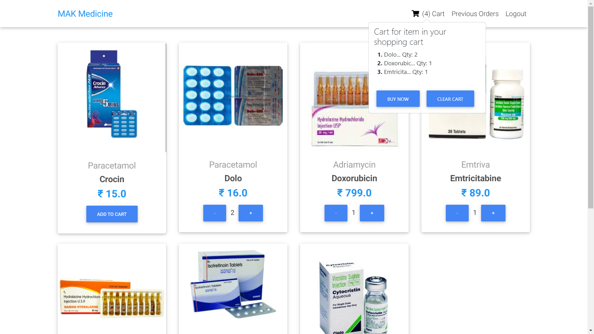
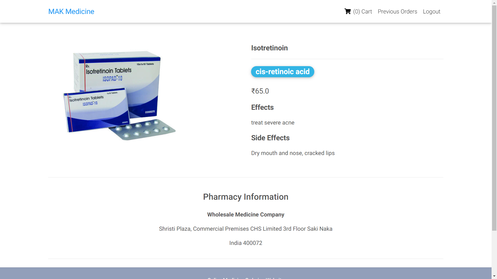
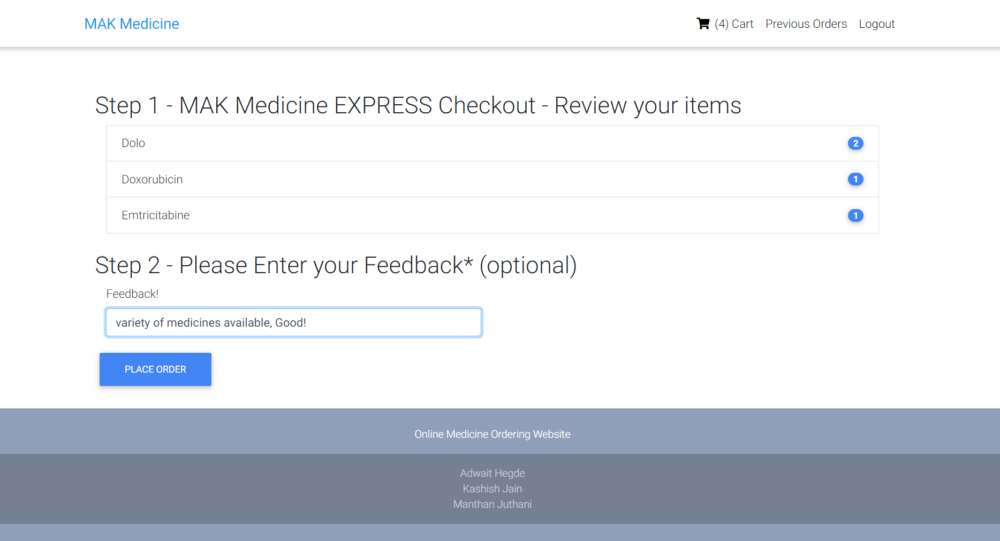
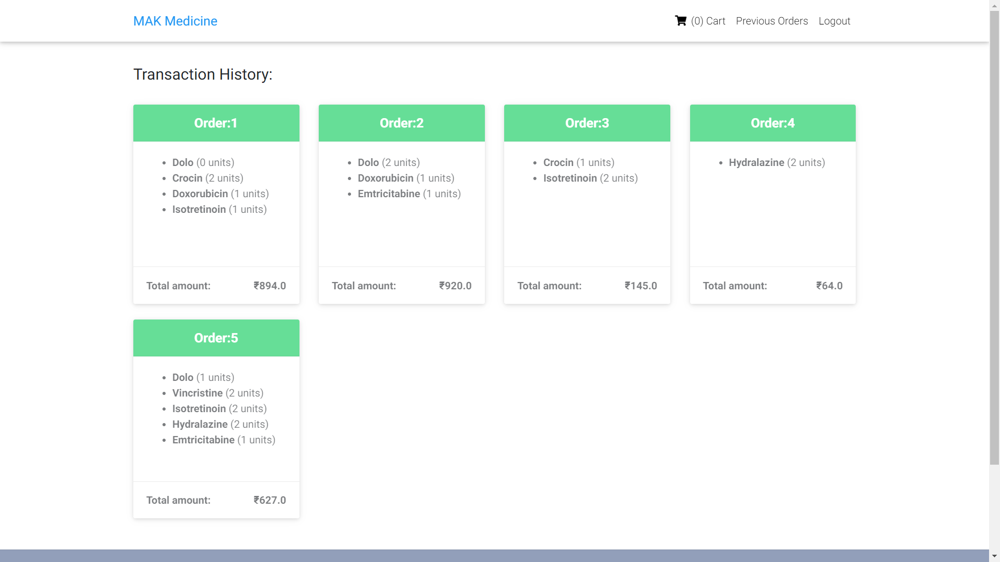

# Online Pharmacy Management System
A database application software that can be used by a patient (customer) that keep records of all the user and the past transactions of their medicines along with the information of medicines & prescriptions, and many other features.

### Models
These are the main tables made:
- User: redefined inbuilt Django user model to add more functionality (i.e. Personal Details) 
- Pharmacy: This was to store the detail of the pharmacy from which medicines are being supplied
- Medicine: All the details of medicines were stored here
- Transaction: The details of transition were stored here. Made two models Order (to store orderID, customerID, and order details) and OrderItem (to store orderID, medicine, and its quantity) 

## Screenshots
These are the screenshots of some important pages

### Home Page:

### Product Page:

### Checkout Page:

### Transaction History:

 

## Tech Stack

The implementation was done on *Django* Framework along with basic *HTML*, *Bootstrap*, *Js*, *CSS*. 

 

#### This project was done by: 
Adwait Hegde,
Kashish Jain,
Manthan Juthani.
